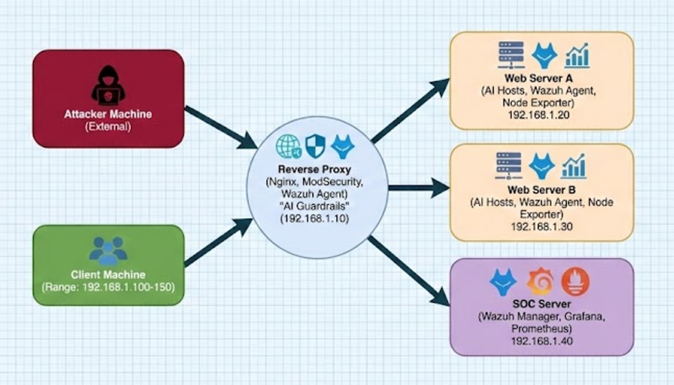

# 🛡️ Mastering Reverse Proxy for Web Server Protection

> [!TIP]
> **Viewing Tip:** Press `Ctrl` + `Shift` + `V` (in VS Code) to toggle the formatted preview of this file.

---

## 📖 Table of Contents
- [Overview](#-overview)
- [Tech Stack](#-tech-stack)
- [System Architecture](#-system-architecture)
- [Installation & Branches](#-installation--branches)

---

## 🧐 Overview
This project demonstrates the implementation of a secure Reverse Proxy architecture to protect web servers. It integrates monitoring, intrusion detection, and visualization tools to ensure a robust security posture.

---

## 💻 Tech Stack
The following technologies are utilized in this deployment:

| Component | Technology | Description |
| :--- | :--- | :--- |
| **Reverse Proxy** |  | Handles load balancing and proxying. |
| **Security** |  | Web Application Firewall (WAF). |
| **SIEM / IDS** |  | Security monitoring and intrusion detection. |
| **Visualization** |  | Dashboard for visualizing logs and metrics. |

---

## 🏗️ System Architecture
*Current planned architecture as of 22/12/2025.*

> **Note:** The architecture above illustrates the flow from the external client through the Nginx reverse proxy to the backend web servers.

---

## 🛠️ Installation & Branches

To view the specific configuration for each component, please navigate to the respective branches:

| Server / Service | Branch Name | Direct Link |
| :--- | :--- | :--- |
| **Reverse Proxy** | `reverseproxy` | [Go to Branch ->](../../tree/reverseproxy) |
| **Web Server A** | `webservera` | [Go to Branch ->](../../tree/webservera) |
| **Web Server B** | `webserverb` | [Go to Branch ->](../../tree/webserverb) |
| **DNS Server** | `dns` | [Go to Branch ->](../../tree/dns) |
| **DHCP Server** | `dhcp` | [Go to Branch ->](../../tree/dhcp) |
| **Wazuh Rules** | `wazuhrules` | [Go to Branch ->](../../tree/wazuhrules) |
